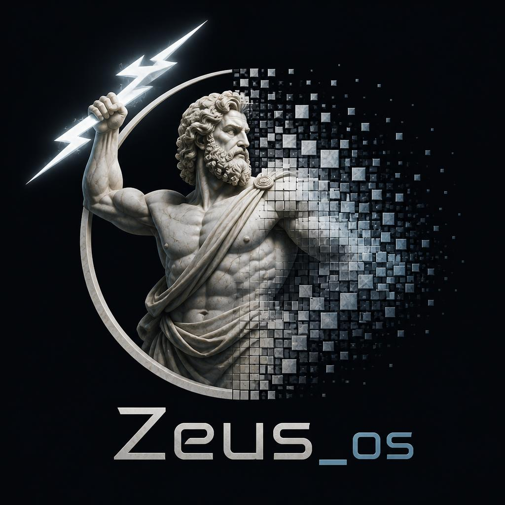

# Zeus_osVM



A fun, educational stack-based virtual machine written in C, designed for experimenting with networking concepts.

## Features

- Stack-based bytecode interpreter with 64-bit words
- First-class socket opcodes: `SOCK_TCP`, `BIND`, `LISTEN`, `ACCEPT`, `CONNECT`, `SEND`, `RECV`, `CLOSE`
- Raw packet opcodes: `RAW_ALLOC`, `RAW_SET_PROTO`, `RAW_SET_DST`, `RAW_SET_SRC`, `RAW_SET_PAYLOAD`, `RAW_SEND`, `RAW_RECV`
- Small assembler (`zasm`) and disassembler (`zdis`)
- Example programs including an echo server, HTTP server, and raw ping

## Building

```bash
make
```

This produces `zeus`, `zasm`, and `zdis`.

## Documentation

Full usage guide — CLI, assembly language, complete opcode reference, worked
examples, and networking — in [`docs/USAGE.md`](docs/USAGE.md).

## Quick Start

Assemble and run the hello example:

```bash
./zasm examples/hello.zasm hello.zeus
./zeus run hello.zeus
```

Or assemble and run in one step:

```bash
./zeus run-asm examples/hello.zasm
```

Disassemble a bytecode file:

```bash
./zdis hello.zeus
```

## Examples

| Example | Description |
|---------|-------------|
| `examples/hello.zasm` | Prints a greeting |
| `examples/echo_server.zasm` | TCP echo server on port 12345 |
| `examples/http_server.zasm` | Tiny HTTP server on port 8080 |
| `examples/raw_ping.zasm` | Allocates and sends a raw ICMP packet (requires root/CAP_NET_RAW) |
| `examples/boot_splash.zasm` | Prints the Zeus_osVM ASCII logo at startup |

## Running Tests

```bash
make test
```

## Architecture

- `include/` public headers
- `src/` VM, assembler, disassembler, and CLI
- `examples/` sample Zeus assembly programs
- `tests/` C unit tests
- `assets/` project logo and ASCII boot splash
- `tools/` helper scripts (logo-to-ASCII generator, splash generator)

The VM uses separate operand and call stacks, a flat runtime memory, and a BSD-sockets-based networking layer.

## Opcode Summary

See `include/isa.h` for the full instruction set. Common opcodes:

- Stack: `PUSH`, `POP`, `DUP`, `SWAP`, `PICK`, `ROLL`
- Arithmetic: `ADD`, `SUB`, `MUL`, `DIV`, `MOD`, `NEG`
- Control: `JMP`, `JZ`, `JNZ`, `CALL`, `RET`, `HALT`
- Memory: `LOAD`, `STORE`, `LOADB`, `STOREB`, `LOADI`, `STOREI`, `LOADBI`, `STOREBI`
- I/O: `PRINT`, `PRINTC`, `READ`

## License

MIT — see [`LICENSE`](LICENSE). Have fun!
